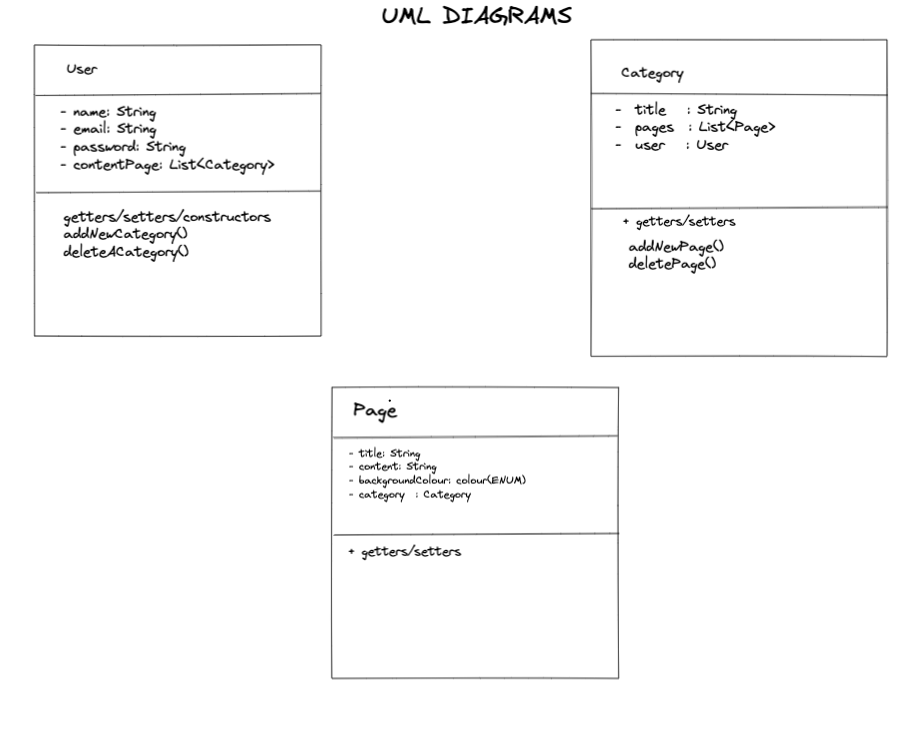
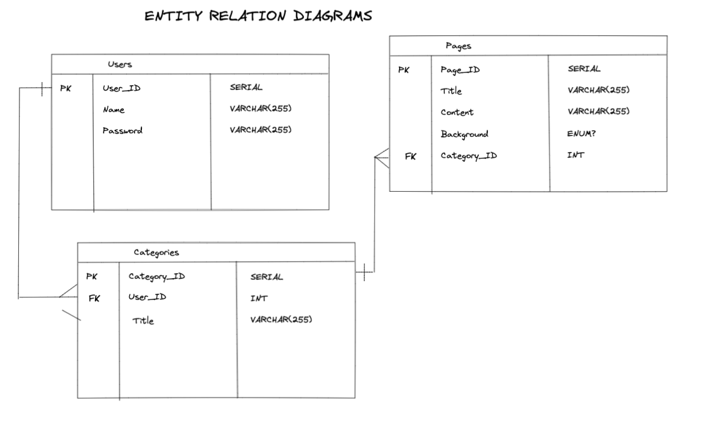
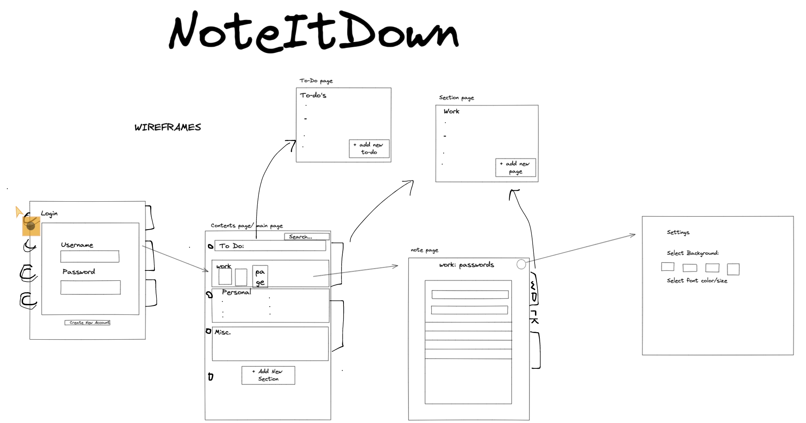

# noteItDown

Organise your day, organise your life!

noteItDown is an app that lets you keep all your notes organised in a digital notebook to store, create and categorise your notes.

## Tech Stack

 noteItDown is created using:
 - Spring/Spring Security
 - React
 - Swagger-ui
 - H2 
 and languages
 - HTML
 - CSS
 - Java
 - JavaScript

## How to use/run the application
- Clone the project from https://github.com/maisha-i/Capstone-fullstack-app
- Open the terminal and run 'npm install'
- Next run 'npm start' and React will open up the application in a web browser
- View it on http://localhost:3000 and sign up to log in
- When logged in, a contents page will be shown where the user can add categories and add notes within those categories
- User can connect to swagger-ui via http://localhost:8080/swagger-ui/index.html#/ to view GET, POST, PUT, DELETE mappings
- User can view relations between the objects using the h2 console via http://localhost:8080/h2. Here they can connect to the database and view the tables generated from the application and filter by using SELECT queries.

## UML diagrams

## Entity Relationship diagrams

## Wireframe

## Functionality

### Login/Register

The first page of the application is the login page which checks if a user is authenticated using a jwt token. If not, the user is able to login to an existing account or create a new account on the register page.

### Contents Page

Once logged in, the user is taken to the contents page where they can see a list of all the categories and notes that they have. They can add/delete categories or add new notes, as well as add, checkoff or delete items from their toDo list. Double clicking on the name of a category allows the user to update the category name. Clicking on a note takes the user to the notes page with that note selected. They are also able to access the settings pages from here.

### Notes Page

On the notes page, a side bar displays all the notes within the chosen category and add new notes. The main page will display the content of the selected note if there is one. If a note is selected, the user is able to edit and save the content of the note.

### Tabs

Once the user is logged in, tabs appear along the side of the notebook which show the names of the note categories the user has. These remain here until the user logs out and allow extra ease of navigation as they allow access directly to the notes page for that category with no note selected.

### Settings Page

Via the cog icon you can access the settings page, here you will be able to view and update your profile information as well as delete your account (can't be undone!)

## Find us on GitHub:

- [Katya Grenier](https://github.com/katyagr)
- [Maisha Islam](https://github.com/maisha-i/)
- [Nikesh Mistri](https://github.com/nikesh-mistri)
- [James Stillman](https://github.com/JStillman1)
